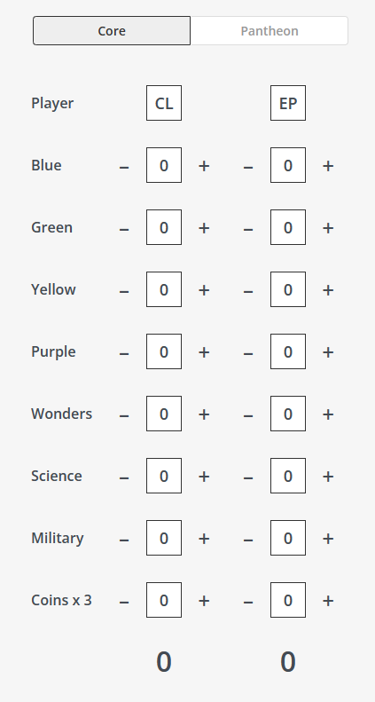
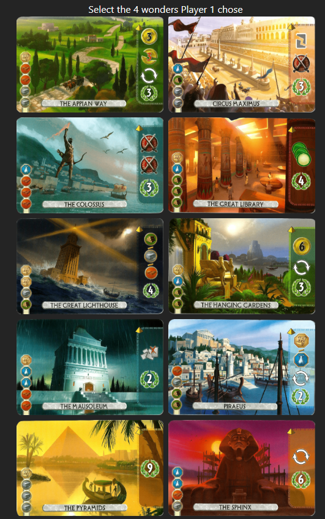
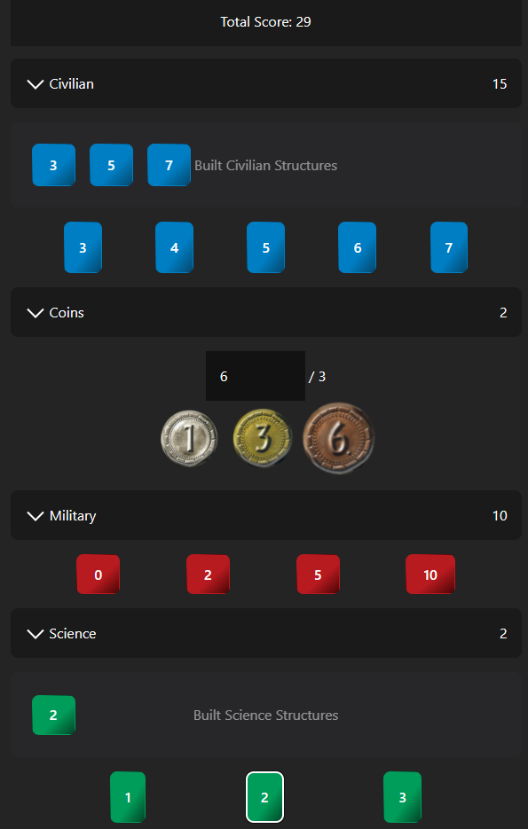
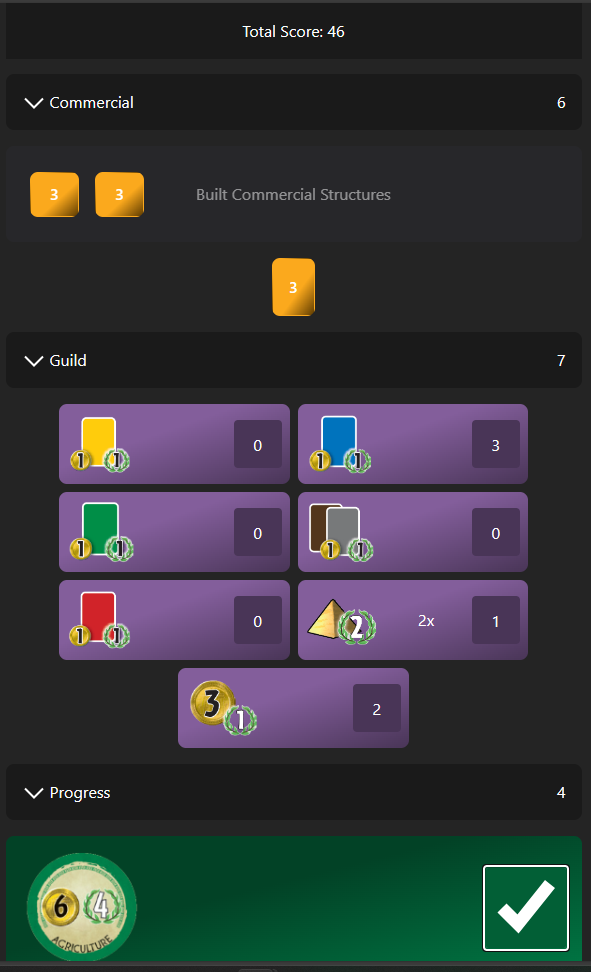
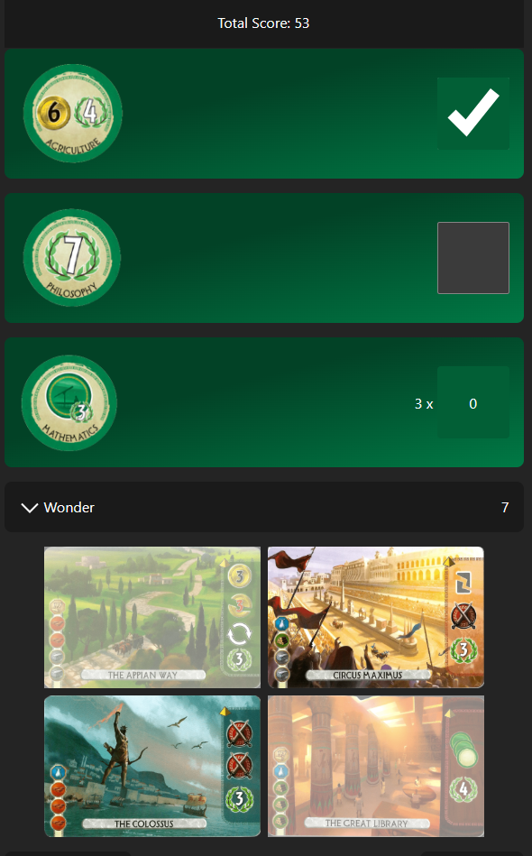

# 7 Wonders Duel Scoring App

A simple scoring app for the board game [7 Wonders Duel](https://boardgamegeek.com/boardgame/173346/7-wonders-duel)

## Production Deployment

[https://seven-wonders-duel-scoring.vercel.app/](https://seven-wonders-duel-scoring.vercel.app/)

## Features

* Simplify the scoring process of 7 Wonders Duel
* Design considerations made to minimize user cognitive load for totaling each score category
* Responsive design
* Support for the [Pantheon expansion](https://boardgamegeek.com/boardgame/202976/7-wonders-duel-pantheon)

## Inspiration

With a desire to keep my Web Development skills up-to-date, in addition to improving upon the design of the only other
free, searchable 7 Wonders Duel scoring website I could find:

[https://ronansprake.co.uk/7-wonders-duel-score-calculator/](https://ronansprake.co.uk/7-wonders-duel-score-calculator/)

I created this React app with the design goal of reducing the overall cognitive load on users looking to total their
score in a game of 7 Wonders Duel.

The main improvements I was looking to make were:

* Minimize the number of interactions/inputs needed from the user
* Minimize any mental math the user might have to do
* Add relevant visualizations & graphics from the board game to help the user more easily understand the category
they're scoring

